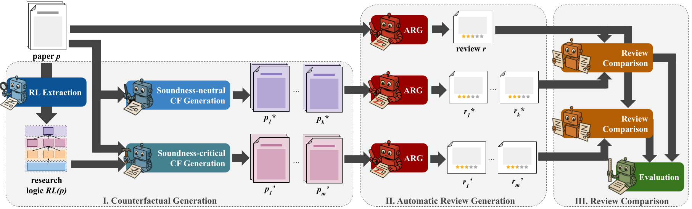

<p  align="center">
  
</p>

# CounterReview Logic: Automatic Reviewers Fail to Detect Faulty Reasoning in Research Papers -- A New Counterfactual Evaluation Framework

[](TBA)
[](https://opensource.org/licenses/Apache-2.0)
[](https://www.python.org/)
[](https://github.com/UKPLab/counter-review-logic/actions/workflows/main.yml)

This is the code associated with the paper "Automatic Reviewers Fail to Detect Faulty Reasoning in Research Papers: A
New Counterfactual Evaluation Framework".

> **Abstract:** Large Language Models (LLMs) have great potential to accelerate and support scholarly peer review and
> are increasingly used as fully automatic review generators (ARGs). However, potential biases and systematic errors may
> pose significant risks to scientific integrity; understanding the specific capabilities and limitations of
> state-of-the-art ARGs is essential. We focus on a core reviewing skill that underpins high-quality peer review:
> detecting faulty research logic. This involves evaluating the internal consistency between a paper’s results,
> interpretations, and claims. We present a fully automated counterfactual evaluation framework that isolates and tests
> this skill under controlled conditions. Testing a range of ARG approaches, we find that, contrary to expectation,
> flaws
> in research logic have no significant effect on their output reviews. Based on our findings, we derive three
> actionable
> recommendations for future work and release our counterfactual dataset and evaluation framework publicly.
>

Contact
person: [Nils Dycke](https://www.informatik.tu-darmstadt.de/ukp/ukp_home/staff_ukp/ukp_home_content_staff_1_details_109248.en.jsp)

[UKP Lab](https://www.ukp.tu-darmstadt.de/) | [TU Darmstadt](https://www.tu-darmstadt.de/)

## Getting Started

### Quickstart

1. Install the package

```bash
pip install git+https://github.com/UKPLab/counter-review-logic
```

2. Download the dataset from [here](https://tudatalib.ulb.tu-darmstadt.de/handle/tudatalib/4802). Depending on your
   use-case, you might want to download different subset; for a quickstart, we assume you downloaded the original papers
   and their counterfactual versions into a folder "data" with a "cf_datasets" subfolder (the counterfactuals) and the
   papers in the "papers" subfolder. See minimal example data structure under [data](./data).

3. Run your own ARG for evaluation or replicate our experiments (see below). If you run any stage that requires an LLM
   you first need to set the necessary environment variables to support API access to the models. Set the fields:
   - `ENDPOINT` (e.g. `https://api.openai.com/v1/chat/completions` for OpenAI)
   - `API_VERSION` (ignore if not applicable)
   - `COST_CACHE_DIR` (for billed APIs; ignore if not applicable; the costs are logged to this directory with a timestamp)
   - `API_KEY` (your API key)
   - `PROMPT_DIR` (by default points to the predefined package prompts, adapt if you want to change them)

### Evaluating your own ARG

Run your ARG on the dataset. You have two options; either you use one of the existing ARGs and run our experimental
pipeline or you run your own ARG outside of the codebase using only the convenience functions to load the data. To do
so, implement the abstract class AutomaticReviewGenerator and run the following code.

```python
# yourarg.py

from counter_review_logic.data import Paper, Review
from counter_review_logic.framework import AutomaticReviewGenerator

# Your ARG as a subclass of AutomaticReviewGenerator
class YourARG(AutomaticReviewGenerator):
    def __init__(self):
        super().__init__(...)
        # Your initialization code here

    def run(self, paper: Paper, **config) -> Review:
        # Your code to generate a review for the given paper
        pass
```

```python
from pathlib import Path
from yourarg import YourARG

from counter_review_logic.experiments import run_experiment_stage

dataset_path = Path("./data") # papers and cf_datasets are subfolders
output_path = Path("./data") # store anywhere, we choose the input folder

argtor = YourARG()

run_experiment_stage(
   stage_name="generate_reviews",
   input_path=dataset_path,
   output_path=output_path,
   argtor=argtor,
   argtor_config={} # pass any config
)

# results are now stored under data/output/reviews with the original reviews in "original" and 
# the other counterfactual reviews under their respective name
```

### Analyze Review Differences

After you ran your ARG on the dataset, you need to analyze the counterfactual vs. original review using the following code.
It will run the review difference detection later used to estimate the ATE.

```python
from counter_review_logic.model.rcd import ScoreRCD
from counter_review_logic.model.rde import ScoreRDE

# run score change detection
rcd = ScoreRCD()

# stored under data/delta
run_experiment_stage(
   stage_name="diff_reviews",
   input_path=dataset_path,
   output_path=output_path,
   argtor=argtor.name,
   rcd=rcd,
   rcd_config={}
)

# run ATE estimator for scores
rde = ScoreRDE()

# stored under data/eval
run_experiment_stage(
   stage_name="compare_reviews",
   input_path=dataset_path,
   output_path=output_path,
   argtor=argtor.name,
   rcd=rcd.name,
   rde=rde,
   rde_config={}
)
```

### Evaluate ARG
Finally, to estimate the ATE of the soundness-critical and -neutral groups, run the following code. Run the 
previous stages for all your ARGs and review difference dimensions you need. The following
code will consider all ARGs and difference dimensions you generated in the output directory.

```python
run_experiment_stage(
   stage_name="ate_zrank",
   input_path=dataset_path,
   output_path=output_path
)
```

The result is output to `data/result` and summarized in the console.

## Dataset Structure

The dataset downloaded from [here](https://tudatalib.ulb.tu-darmstadt.de/handle/tudatalib/4802) consists of multiple parts.

#### Papers
The `papers.zip` contains the parsed papers used for evaluation and meta-information on the included venues (incl. 
review template etc.). Each conference has a subdirectory containing the paper directories with the following structure:

```
CONFERENCE_ID
   > CONFERENCE_ID%PAPER_ID
      > media                 # contains figures/tables of the article by id; usually .png
      index.json              # the structured representation of the paper mapping lines to sections etc. (see example file)
      meta.json               # meta data on the paper including authors and license
      paper.html              # the paper HTML based on ar5iv
      paper.md                # the markdown formatted version of the paper based on the html; we use this during experiments
```

Load papers via the data loader for papers with `from counter_review_logic.data import load_paper_dataset`.

#### Blueprints
The blueprints aka the research logic representation of each tested paper are not necessary for evaluation
of new ARGs on the same data but we provide them as a useful resource and for replication.
They can be found in `blueprints.zip` with each `<paper id>.json` containing the research logic of the paper with
the respective id. Each blueprint contains the following fields:

```json
{
    "paper": "<id of the paper the blueprint belongs to>",
    "research_goal": {
        "research_goal": "The paper aims to address the challenge of noise and redundancy in video multimodal fusion by proposing a denoising bottleneck fusion (DBF) model that maximizes mutual information to preserve critical information across different modalities. This is essential for improving tasks like multimodal sentiment analysis and summarization.",
        "paper_genre": "Method Paper",
        "secondary_genre": "null",
        "confidence": "High",
        "reasoning": "The paper presents a novel algorithm (DBF model) designed to improve the integration of multimodal signals in videos by reducing noise and redundancy while preserving key information. The focus on a specific technical solution and performance improvements on benchmark tasks clearly aligns it with the 'Method Paper' genre."
    },
    "all_contributions": [
        ...,
        {
            "claim_summary": "<Summary of the contribution claim>",
            "type": "<paper type, e.g. finding>",
            "evidence": "<verbatim citation as proof>",
            "location": "<location of proof , e.g. paragraph 0>",
            "score": 9,
            "score_explanation": "<explanation for score by importance of contribution to the paper>",
            "speculative": "<No/Yes -- if yes, the contribution claim is projective and not anchored in experiments>",
            "id": "<id of the contribution claim used later>",
            "coreferences": [
               ...
            ]
        },
       ...
    ],
    "findings_contributions": [
        "<lists the contribution claim ids that are findings derived from expeirments>"
    ],
    "conclusions": {
        "<conclusion id>": {
            "conclusion_summary": "<two sentence summary of the conclusion as a claim>",
            "id": "<conclusion id>>",
            "evidences": [
               ...
            ],
            "context": "<explanation of the conclusion in the context of the paper>",
            "associated_contribution_claims": [
                "<ids of the contribution claims that are based on this conclusion>"
            ],
            "relevance_to_claim": "<explains why the listed contribution claims are relevant>",
            "coreferences": [
               ...
            ]
        },
       ...
    },
    "results": {
        "<result id>": {
            "result_summary": "<summary of the key result>",
            "evidences": [
               ...
            ],
            "id": "<result id>>",
            "associated_conclusions": [
                "<id of the conclusions derived from this result>"
            ],
            "relevance_to_conclusion": "<explanation how the conclusions derived from this result>",
            "coreferences": [
               ...
            ]
        },
       ...
    },
    "method": {
        "pipeline_summary": "<summarizes all research steps in the paper>",
        "relevance": "<explains how the method is relevant to the research goal>",
        "input_artifacts": "<the underlying data and resources the method depends on>",
        "steps": [
            {
                "step_number": 1,
                "description": "<summary of the research activity>",
                "evidences": [
                   ...
                ],
                "output": "<the outcome of this step>",
                "criticality": "<why this step is necessary and what would happen if it was omitted>",
                "type": "<category of activity, e.g. data processing>",
                "results": [
                   "<ids of results that are based on this step>"
                ],
                "coreferences": [
                   ...
                ]
            },
           ...
        ]
    }
}
```

Load blueprints via the data loader with `PaperBlueprint.load_json() in counter_review_logic.framework`.

#### Counterfactual Datasets
The `cf_datasets.zip` contains the counterfactual datasets used for evaluation. Each CF type has its own subfolder 
indicating the type of change (e.g. `paper_layout` for layout changes). Each CF type folder conains a `.json` for each
paper's counterfactuals with the following structure:

```json
{
    "o_paper": "<id of the paper the counterfactuals belong to>",
    "cf_paper": {
       "id": "<id of the original paper>",
       "meta": "<meta data of the original paper>",
       "md": "<markdown of the counterfactual papers, i.e. including changes>",
       "structured_md": "<structured representation of the counterfactual paper like for the original>"
    },
    "changes": [,
      "<depends on the CF type; usually a list of edits with locations",
       ...
    ],
   "counterfactual_type": "<type of the counterfactual, e.g. paper_layout>"
}
```

## Extended Experiments

### Overview
The counterfactual evaluation pipeline of CounterReview Logic consists of the stages depicted in the following figure.
You can run each stage depending on your needs.

<p  align="center">
  
</p>

### Research Logic Extraction (aka Blueprint Generation)

Before you can create new soundness-effective counterfactuals on new papers, you need to infer their underlying
research logic (aka generating their blueprint). Assuming you placed your papers under `data/papers` in the format
described above, you can run the following script to generate the blueprints.

First, adapt or create your own config file. Our example file is located at `data/configs/blueprints.yaml`. Then 
run the CLI passing the config and input and output paths. This steps requires passing LLM API information in the config;
you may choose Ollama / OpenAI / DeepSeek.

```bash
python3 -m counter_review_logic \
  --experiment blueprints \
  --config data/configs/blueprints.yaml \
  --input_path data \
  --output_path data
```

### Creating New Counterfactuals

After extracting the research logic -- if you want to use a soundness-critical edit type -- you can create counterfactuals
for new papers. Assuming you placed your papers under `data/papers` and generated your blueprints under `data/blueprints`,
you can run the following script to generate the counterfactuals. 

First, adapt or create your own config file. Our example file is located at `data/configs/counterfactuals.yaml`. Then
run the CLI passing the config and input and output paths.

```bash
python3 -m counter_review_logic \
  --experiment counterfactuals \
  --config data/configs/counterfactuals.yaml \
  --input_path data \
  --output_path data
```

### Evaluating your ARG on new papers

Assuming you created (or copied) you counterfactuals under `data/cf_datasets` and placed your papers under `data/papers`,
you can run the following script to evaluate your ARG on the dataset on a specific dimension.

First, adapt or create your own config file. Our example file is located at `data/configs/evaluate.yaml`.

```bash
python3 -m counter_review_logic \
  --experiment evaluate \
  --config data/configs/evaluate.yaml \
  --input_path data \
  --output_path data
```

The detailed results, i.e. per-instance estimates, are stored under `data/eval`. Now, to estimate the ATE and get a 
ranking, simply run:

```bash
python3 -m counter_review_logic \
  --experiment analyze \
  --input_path data \
  --output_path data
```

This logs the final results to console and stores them under `data/result`.

### Replicating Experiments

Simply place all downloaded data, i.e. the papers and the cf_datasets, under `data` as described above. Then run the
above script to analyze review differences and estimate the ATE.

## Cite

Please use the following citation:

```
@misc{dycke2025automaticreviewersfaildetect,
      title={Automatic Reviewers Fail to Detect Faulty Reasoning in Research Papers: A New Counterfactual Evaluation Framework}, 
      author={Nils Dycke and Iryna Gurevych},
      year={2025},
      eprint={2508.21422},
      archivePrefix={arXiv},
      primaryClass={cs.CL},
      url={https://arxiv.org/abs/2508.21422}, 
}
```

## Disclaimer

> This repository contains experimental software and is published for the sole purpose of giving additional background
> details on the respective publication. 
