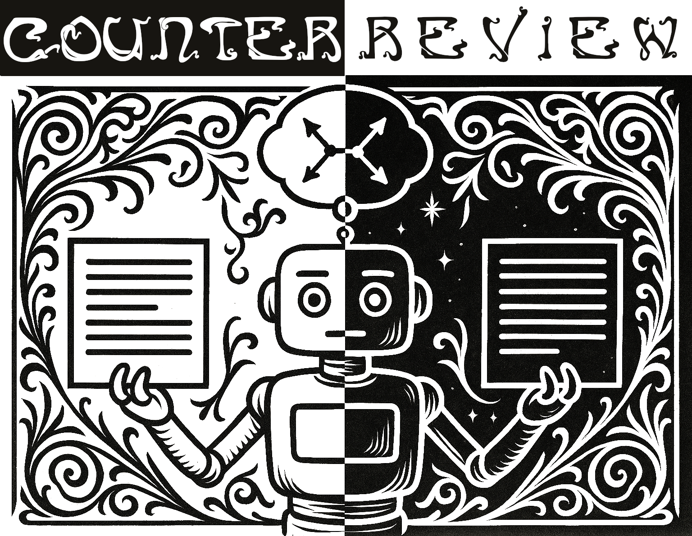

<p  align="center">
  
</p>

# CounterReview Logic: Automatic Reviewers Fail to Detect Faulty Reasoning in Research Papers -- A New Counterfactual Evaluation Framework
[](TBA)
[](https://opensource.org/licenses/Apache-2.0)
[](https://www.python.org/)
[](https://github.com/UKPLab/counter-review-logic/actions/workflows/main.yml)

This is the code associated with the paper "Automatic Reviewers Fail to Detect Faulty Reasoning in Research Papers: A New Counterfactual Evaluation Framework".

> **Abstract:** Large Language Models (LLMs) have great potential to accelerate and support scholarly peer review and are increasingly used as fully automatic review generators (ARGs). However, potential biases and systematic errors may pose significant risks to scientific integrity; understanding the specific capabilities and limitations of state-of-the-art ARGs is essential. We focus on a core reviewing skill that underpins high-quality peer review: detecting faulty research logic. This involves evaluating the internal consistency between a paper’s results, interpretations, and claims. We present a fully automated counterfactual evaluation framework that isolates and tests this skill under controlled conditions. Testing a range of ARG approaches, we find that, contrary to expectation, flaws in research logic have no significant effect on their output reviews. Based on our findings, we derive three actionable recommendations for future work and release our counterfactual dataset and evaluation framework publicly.
> 

Contact person: [Nils Dycke](https://www.informatik.tu-darmstadt.de/ukp/ukp_home/staff_ukp/ukp_home_content_staff_1_details_109248.en.jsp) 

[UKP Lab](https://www.ukp.tu-darmstadt.de/) | [TU Darmstadt](https://www.tu-darmstadt.de/)

## Getting Started

### Quickstart
1. Install the package

```bash
pip install git+https://github.com/UKPLab/counter-review-logic
```

2. Download the dataset

TBA

3. Run your ARG on the dataset


4. Evaluate your ARG

### Dataset Structure

TBA


## Usage

### Step-by-step Guide to Create New Counterfactuals

TBA

### Step-by-step Guide to Test a New ARG

TBA

## Replicating Experiments

### Blueprint Generation

TBA

### Review Generation

TBA

### Review Difference Detection

TBA

### Average Treatment Effect Estimation

TBA

## Development

### Step-by-step Guide to Add a New Evaluation Metric

TBA


## Cite

Please use the following citation:

```
TBA
```

## Disclaimer

> This repository contains experimental software and is published for the sole purpose of giving additional background details on the respective publication. 
